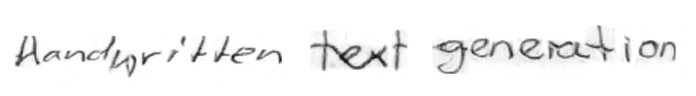

# ScrabbleGAN - Handwritten Text Generation
A PyTorch implementation of the [ScrabbleGAN: Semi-Supervised Varying Length Handwritten Text Generation](https://arxiv.org/abs/2003.10557) paper.
Parts of the code have been adapted from the [official implementation of the paper](https://github.com/amzn/convolutional-handwriting-gan.git).
The purpose of this repository is to provide a clear and simple way to understand and replicate the results of the paper.



## Requirements
- [PyTorch v1.6.0](https://pytorch.org) - for all the deep learning components
- [PyTorch-FID](https://github.com/mseitzer/pytorch-fid.git) - for FID score calculation
- [OpenCV 3](https://pypi.org/project/opencv-python/) - for image processing (not required for generating new images)

A complete `requirements.txt` file will be added soon.

## Steps for training the ScrabbleGAN model from scratch
1. Download the [IAM dataset](http://www.fki.inf.unibe.ch/databases/iam-handwriting-database)
or the [RIMES database](http://www.a2ialab.com/doku.php?id=rimes_database:start)
and keep them in the data `/data/` directory as shown below:
    ```bash
    ├── data
    |   ├── IAM
    |       └──ascii
    |           └──words.txt
    |       └──words
    |           └──a01
    |           └──a02
    |           .
    |           .
    |       └──original_partition
    |           └──te.lst, tr.lst, va1.lst, va2.lst
    |   ├── RIMES
    |       └──ground_truth_training_icdar2011.txt
    |       └──training
    |           └──lot_1
    |           └──lot_2
    |           .
    |           .
    |       └──ground_truth_validation_icdar2011.txt
    |       └──validation
    |           └──lot_14
    |           └──lot_15
    |           └──lot_16
    |       .
    |       .
    |   └── prepare_data.py 
   ```
   
2. Modify the `/config.py` file to change dataset, model architecture , image height, etc. 
The default parameters indicate the ones used in the paper.
3. From the `data` directory, run:
    ```bash
    python prepare_data.py
    ```
    This will process the ground-truth labels and images, and create a pickle file to be used for training. 

4. Start model training by running the below command from the main directory:
    ```bash
    python train.py
    ```
   This will start training the model. A sample generated image will be saved in the `output` directory
   after every epoch. Tensorboard logging has also been enabled.  

## Steps for generating new images
The easiest way to generate images is to use this [demo](https://colab.research.google.com/drive/1IsMN1T83RozcZ_1zJTjYmy6fIEbcUzhZ?usp=sharing);
it has options for generating random text, specific text, random styles, consistent style, etc.
Another option is to download these files:
1. Pretrained models for [English (IAM)](https://drive.google.com/file/d/11w1p8RVLml9cidMrkQpdo648pNPdQFxZ/view?usp=sharing)
or [French (RIMES)](https://drive.google.com/file/d/16oasVsBExwHhCmYDSR1uhV10NiWYZ-OY/view?usp=sharing).
2. Character mapping for [English (IAM)](https://drive.google.com/uc?id=10bXCFp7a7MyUFKR55rUeqWNrEe2300TP) or ([French (RIMES)](https://drive.google.com/uc?id=1vjj7DfT_T3c4q-18LNpo7YMcRCUnh7aF).
3. Lexicon files for [English](https://github.com/dwyl/english-words/blob/master/words.txt) or [French](https://github.com/AdrienVannson/Decorrecteur/blob/master/Lexique383).

After downloading the required files, follow the below steps:

1. Change the `dataset` and `lexicon_file` path in `config.py`.
2. Run:
    ```bash 
    python generate_images.py -c 'path_to_checkpoint_file' -m 'path_to_character_mapping_file'
    ```
   This will generate random images. You can also check the arguments in `generate_images.py` to see more options.

## Steps to check FID score
Create the preprocessed data file as described in steps 1-3 of "Steps for training the ScrabbleGAN model from scratch".
Also, either download the model checkpoints for [English (IAM)](https://drive.google.com/file/d/11w1p8RVLml9cidMrkQpdo648pNPdQFxZ/view?usp=sharing)
or [French (RIMES)](https://drive.google.com/file/d/16oasVsBExwHhCmYDSR1uhV10NiWYZ-OY/view?usp=sharing), or
train your own model and save the checkpoints. To check the FID score, run:
    ```bash 
    python calculate_metrics.py -c 'path_to_checkpoint_file'
    ```

## Steps for training HTR models
One of the motivation in the paper was to boost the HTR performance using synthetic data generated by ScrabbleGAN.
The code for HTR training has not been provided in this repository for consistency with the author's
approach of using this [code](https://github.com/clovaai/deep-text-recognition-benchmark) for HTR training.
You can follow the below steps for HTR training:
1. Create your own models or download all the files listed in "Steps for generating new images". Also, 
create the preprocessed data file as described in steps 1-3 of "Steps for training the ScrabbleGAN model from scratch".
2. If required, change `dataset`, `partition`, `data_file`, `lexicon_file` in `config.py`
3. To create LMDB data files required for HTR training, run:
    ```bash 
    python create_lmdb_dataset.py -c 'path_to_checkpoint_file' -m 'path_to_character_mapping_file'
    ```
   to create lmdb dataset without any synthetic images, or
    ```bash 
    python create_lmdb_dataset.py -c 'path_to_checkpoint_file' -m 'path_to_character_mapping_file' -n 100000
    ```
    to add generated images to the original dataset.
4. Train the HTR model as described [here](https://github.com/clovaai/deep-text-recognition-benchmark#when-you-need-to-train-on-your-own-dataset-or-non-latin-language-datasets)

## References
- [ScrabbleGAN paper](https://arxiv.org/abs/2003.10557)
- [RIMES](http://www.a2ialab.com/doku.php?id=rimes_database:start)
- [IAM](https://fki.tic.heia-fr.ch/databases/iam-handwriting-database)
- [PyTorch FID](https://github.com/mseitzer/pytorch-fid)
- [PyTorch BigGAN](https://github.com/ajbrock/BigGAN-PyTorch)
